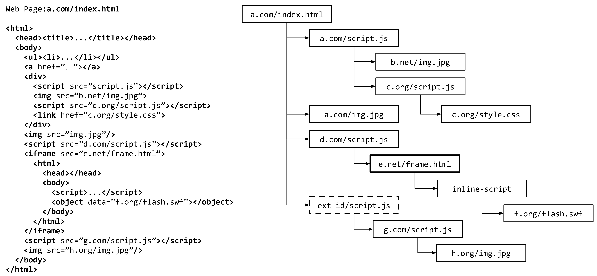

# Introduction

A website can include resources in an HTML document from any origin so long as the inclusion respects the same origin policy, its standard exceptions, or any additional policies due to the use of **`CSP`**, **`CORS`**, or other access control framework. A first approximation to understanding the inclusions of third-party content for a given web page is to process its **`DOM tree`** while the page loads. However, direct use of a web page's DOM tree is unsatisfactory because the DOM does not in fact reliably record the inclusion relationships between resources referenced by a page. This follows from the ability for JavaScript to manipulate the DOM at run-time using the DOM API.

Instead, in this work we define an **`Inclusion Tree`** abstraction extracted directly from the browser's resource loading code. Unlike a DOM tree, the inclusion tree represents how different resources are included in a web page that is invariant with respect to run-time DOM updates. It also discards irrelevant portions of the DOM tree that do not reference remote content. For each resource in the inclusion tree, there is an **`Inclusion Sequence (Chain)`** that begins with the root resource (i.e., the URL of the web page) and terminates with the corresponding resource. Furthermore, browser extensions can also manipulate the web page by injecting and executing JavaScript code in the page's context. Hence, the injected JavaScript is considered a direct child of the root node in the inclusion tree. An example of a DOM tree and its corresponding inclusion tree is shown in the following figure. As shown in the right side of the figure, **`f.org/flash.swf`** has been dynamically added by an **`inline script`** to the DOM tree, and its corresponding **`inclusion sequence (chain)`** has a length of 4 since we remove the **`inline`** resources from **`inclusion sequence (chain)`**. Moreover, **`ext-id/script.js`** is injected by an extension as the direct child of the root resource. This script then included **`g.com/script.js`**, which in turn included **`h.org/img.jpg`**.



# Design

Our crawler is built by using the **`Chrome Debugging Protocol (CDP)`**. CDP provides programmatic access to the browser and allows clients to attach to open windows, inspect network traffic, and interact with the JavaScript environment and the DOM tree loaded in the window.

# Prerequisites

Install `NodeJS` from https://nodejs.org/en/download/. Then, run the following command to install the dependencies:

``` sh
npm install chrome-launcher chrome-remote-interface url-parse util tldjs path shuffle-array argparse
```

# Data Collection

``` sh
node crawler.js --site DOMAIN --number NUM_URLS [--cookies FILENAME] [--headless] > output.logs
```

The cookie filename is an optional JSON file, which can be extracted from `output.logs`.

# Extracting Inclusion Tree

``` sh
./inclusion_tree.py output.logs > output.json
```

# References

[1] **Sajjad Arshad**, Amin Kharraz, William Robertson, "[**Include Me Out: In-Browser Detection of Malicious Third-Party Content Inclusions**](https://sajjadium.github.io/files/fc2016excision_paper.pdf)", International Conference on Financial Cryptography and Data Security (**FC**), **2016**.

[2] Muhammad Ahmad Bashir, **Sajjad Arshad**, William Robertson, Christo Wilson, "[**Tracing Information Flows Between Ad Exchanges Using Retargeted Ads**](https://sajjadium.github.io/files/usenixsec2016retargetedads_paper.pdf)", **USENIX Security** Symposium, **2016**.

[3] **Sajjad Arshad**, Amin Kharraz, William Robertson, "[**Identifying Extension-based Ad Injection via Fine-grained Web Content Provenance**](https://sajjadium.github.io/files/raid2016origintracer_paper.pdf)", International Symposium on Research in Attacks, Intrusions and Defenses (**RAID**), **2016**.

[4] Muhammad Ahmad Bashir, **Sajjad Arshad**, Christo Wilson, "[**Recommended For You: A First Look at Content Recommendation Networks**](https://sajjadium.github.io/files/imc2016crn_paper.pdf)", ACM Internet Measurement Conference (**IMC**), **2016**.

[5] Tobias Lauinger, Abdelberi Chaabane, **Sajjad Arshad**, William Robertson, Christo Wilson, Engin Kirda, "[**Thou Shalt Not Depend on Me: Analysing the Use of Outdated JavaScript Libraries on the Web**](https://sajjadium.github.io/files/ndss2017jslibs_paper.pdf)", Network and Distributed System Security Symposium (**NDSS**), **2017**.

[6] Muhammad Ahmad Bashir, **Sajjad Arshad**, Engin Kirda, William Robertson, Christo Wilson, "[**How Tracking Companies Circumvented Ad Blockers Using WebSockets**](https://sajjadium.github.io/files/imc2018websockets_paper.pdf)", ACM Internet Measurement Conference (**IMC**), **2018**.
